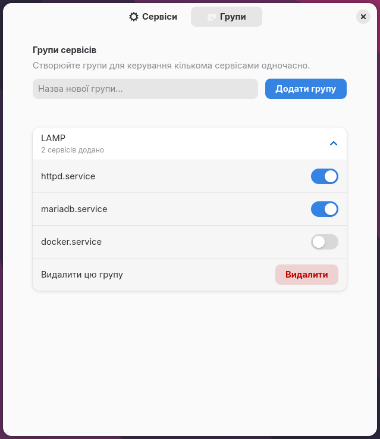

---

# 😈 Systemd Manager Neo

**Systemd Manager Neo** is a sophisticated GNOME Shell extension designed for power users, developers, and sysadmins who need instant control over their system services. It brings the power of `systemctl` to your top panel with a clean, modern, and native GNOME interface.

## ✨ Key Features

* **📁 Service Groups & Profiles [NEW]**: Create custom groups (e.g., "Dev Stack", "LAMP") to start or stop multiple related services with a single click.
* **🚨 Micro-Monitoring [NEW]**: If any service within a group crashes (`FAILED` state), the group's title instantly turns red with an error icon, alerting you immediately without any background CPU drain.
* **🔍 Advanced Filtering & Pagination [NEW]**: Effortlessly search through hundreds of system units. Filter by Bus (System/User) and State (Enabled/Disabled). Use "Load More" or "Load All" for buttery-smooth scrolling.
* **📊 Real-time Insights**: Monitor service status, Uptime, and RAM consumption directly from the panel menu.
* **📌 Custom Ordering**: Full control! Arrange your pinned services using Up/Down arrows in Preferences.
* **🔌 Dual Bus Support**: Effortlessly toggle between System-wide and User (Session) services.
* **📜 One-Click Logs**: Instantly launch `journalctl -f` in your preferred terminal emulator.
* **🎨 Native Libadwaita UI**: A beautifully crafted multi-tab Preferences window that seamlessly fits into modern GNOME aesthetics.

## 📸 Screenshots

| Panel Menu & Service Control | Service Groups & Micro-Monitoring |
| :---: | :---: |
|  |  |
| **Preferences: Services & Filters** | **Preferences: Group Management** |
|  |  |

## 💡 How to Create Service Groups

Setting up groups is designed to keep your panel clean and highly organized. Follow these simple steps:

1. **Pick your Favorites**: Open Settings, go to the **Services** tab, and use the search or filters to find the services you need. Click the `+` button to add them to your *Favorite Services* list.
2. **Create a Group**: Switch to the **Groups** tab, type a name for your new group (e.g., "LAMP Stack"), and click "Add Group".
3. **Assign Services**: Expand your newly created group and toggle the switches to assign your favorite services to it.

> *Pro Tip: Grouped services will automatically be hidden from the main standalone list to keep your GNOME panel menu perfectly tidy!*

## 🌍 Supported Languages

Thanks to our amazing community, the extension speaks 6 languages natively right out of the box:
🇬🇧 **English** | 🇺🇦 **Ukrainian** | 🇵🇱 **Polish** | 🇪🇸 **Spanish** | 🇸🇰 **Slovak** | 🇩🇪 **German**

## 🚀 Installation

### 1. From GNOME Extensions

The recommended way is to install it via the [Official GNOME Extensions Website](https://extensions.gnome.org).

### 2. Manual Installation

For those who prefer building from source:

1. **Clone the repository**:
```bash
git clone https://github.com/ladoleo/systemd-manager-neo.git
cd systemd-manager-neo

```


2. **Compile schemas & Locales**:
```bash
glib-compile-schemas schemas/
# Ensure you compile your .po files into the locale/ directory

```


3. **Deploy**:
```bash
mkdir -p ~/.local/share/gnome-shell/extensions/
cp -r . ~/.local/share/gnome-shell/extensions/systemd-manager-neo@ladoleo.local

```


4. **Restart Shell**: Press `Alt+F2`, type `r` and hit `Enter` (X11) or Log out and Log in (Wayland).

## 🛠 Specifications

* **Shell Support**: Optimized for GNOME Shell versions 47, 48, 49, and 50.
* **Licensing**: Distributed under the **GNU GPLv3** license.

## 🤝 Contributing

Feel free to:

* Report bugs via [Issues](https://github.com/ladoleo/systemd-manager-neo/issues).
* Propose new features or improvements.
* Submit Pull Requests with localizations or code optimizations.

---

*Developed with ☕️ and passion for GNOME.*