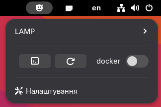
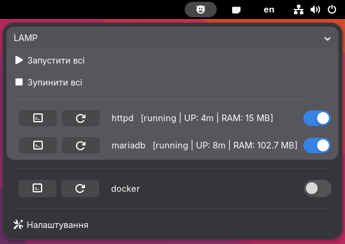
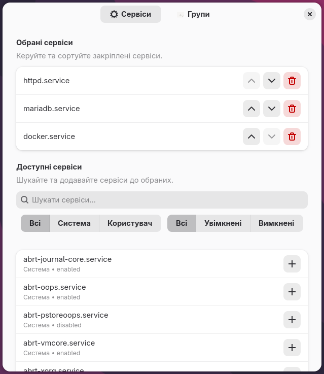

---

# 😈 Systemd Manager Neo

**Systemd Manager Neo** is a sophisticated GNOME Shell extension designed for power users and developers who need instant control over their system services. It brings the power of `systemctl` to your top panel with a clean, modern interface.

[](https://www.gnu.org/licenses/gpl-3.0)
[](https://extensions.gnome.org)

## ✨ Features

*   **Real-time Insights**: Monitor service status, Uptime, and RAM consumption directly from the menu.
*   **Dual Bus Support**: Effortlessly toggle between System-wide and User (Session) services.
*   **One-Click Logs**: Instantly launch `journalctl -f` in your preferred terminal emulator.
*   **Smart Indicators**: Dedicated visual alerts for services in a `FAILED` state to ensure you never miss a system issue.
*   **Modern UI**: Built using Libadwaita for the preferences window, ensuring a seamless fit with the latest GNOME aesthetics.

## 📸 Screenshots

| Service Control | Performance Monitoring | Preferences (Libadwaita) |
| :--- | :--- | :--- |
|  |  |  |

## 🚀 Installation

### 1. From GNOME Extensions
The recommended way is to install it via the [Official GNOME Extensions Website](https://extensions.gnome.org).

### 2. Manual Installation
For those who prefer building from source:

1.  **Clone the repository**:
    ```bash
    git clone https://github.com/ladoleo/systemd-manager-neo.git
    cd systemd-manager-neo
    ```
2.  **Compile schemas**:
    ```bash
    glib-compile-schemas schemas/
    ```
3.  **Deploy**:
    ```bash
    mkdir -p ~/.local/share/gnome-shell/extensions/
    cp -r . ~/.local/share/gnome-shell/extensions/systemd-manager-neo@ladoleo.local
    ```
4.  **Restart Shell**: Press `Alt+F2`, type `r` and hit `Enter` (X11) or Log out and Log in (Wayland).

## 🛠 Specifications

*   **Shell Support**: Optimized for GNOME Shell versions 47, 48, 49, and 50.
*   **Licensing**: Distributed under the **GNU GPLv3** license.

## 🤝 Contributing

Feel free to:
*   Report bugs via [Issues](https://github.com/ladoleo/systemd-manager-neo/issues).
*   Propose new features or improvements.
*   Submit Pull Requests with localizations or code optimizations.
